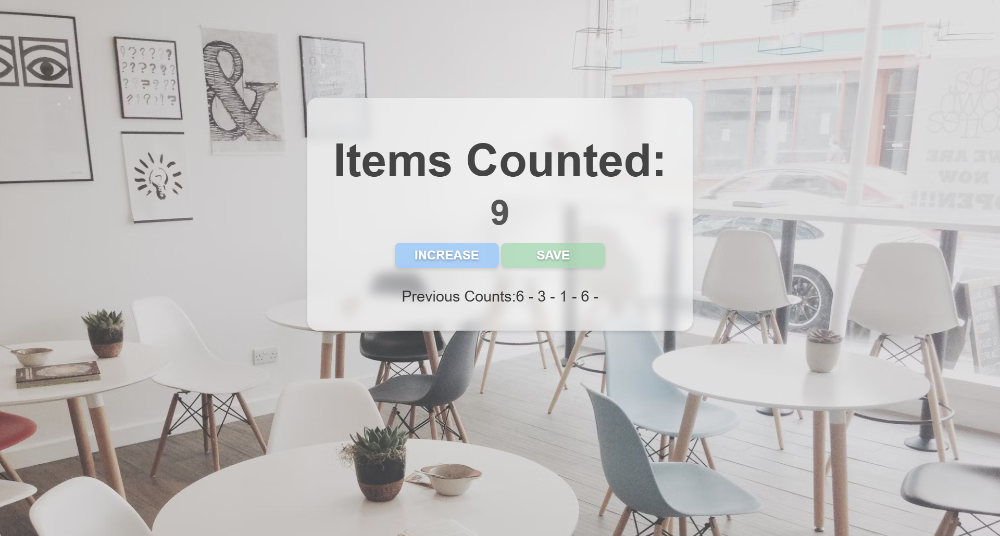
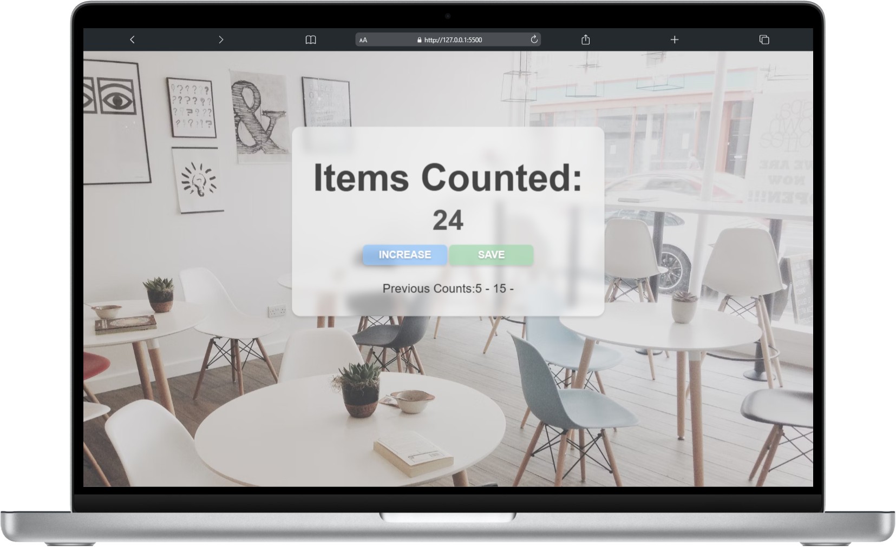
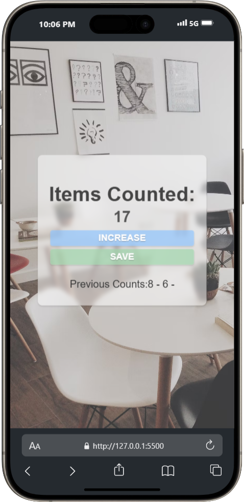

# **CountEase**

## **Table of Contents**
- [Project Overview](#project-overview)
- [Features](#features)
- [Installation](#installation)
- [Usage](#usage)
- [Technologies Used](#technologies-used)
- [Screenshots](#screenshots)
- [License](#license)

## **Project Overview**
CountEase is a simple and intuitive counter application that allows users to increment and save counts easily. Built using HTML, CSS, and JavaScript, it provides a clean and responsive interface for tracking simple counts across sessions.

## **Features**
- Responsive design optimized for both mobile and desktop devices.
- Live count updates with the ability to increment and save previous counts.
- Clear and minimalistic UI with animated buttons for a smooth user experience.
- Modular and easily customizable for additional features.

## **Installation**
- Clone the repository.
- Navigate to the project directory: `cd CountEase`
- Run `npm install` to install required dependencies.
- Run `npm run dev` to launch the development server.

## **Usage**
- Use the **Live Server** extension to preview the project in your local browser.
- Customize the styling or extend the functionality by editing the `index.css`, `index.html`, and `index.js` files.

## **Technologies Used**
-  - Used for structuring the content.
-  - Used for styling components.
-  - Used for interactivity and logic implementation.

## **Screenshots**

  
  
  

## **License**
This project is licensed under the MIT License - see the [LICENSE](LICENSE) file for details.
